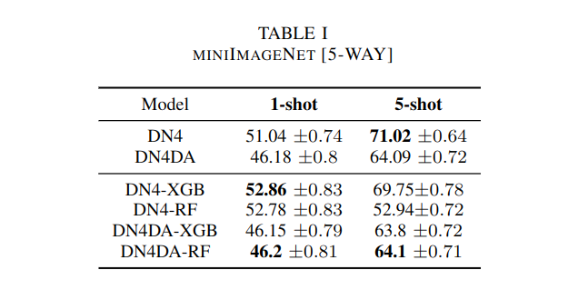
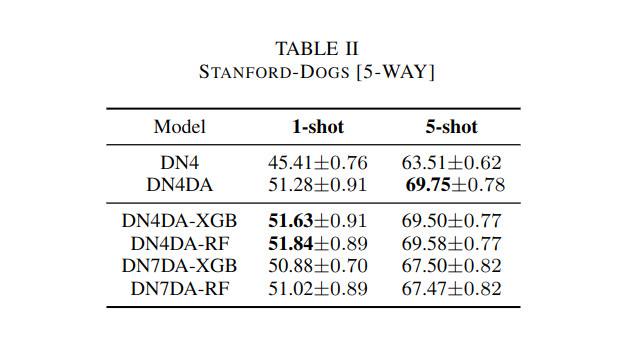

# Short programming project: Few-shot learning for image classification

The project explore the findings in the paper [Revisiting Local Descriptor based Image-to-Class Measure for Few-shot Learning](http://cs.nju.edu.cn/rl/people/liwb/CVPR19.pdf) by Wenbin Li, Lei Wang, Jinglin Xu, Jing Huo, Yang Gao and Jiebo Luo. In CVPR 2019.


## Prerequisites
- Linux
- Python 3.8 - 3.10
- All library dependencies from `requirements.txt`

## Getting Started
### Installation

- Clone this repo:
```bash
git clone https://github.com/d33dler/spp.git
```

- Install `requirements.txt` dependencies
- cd to the `executables` folder and run `python exec.py --help` to see the available options.

### Datasets
- [miniImageNet](https://drive.google.com/file/d/1fUBrpv8iutYwdL4xE1rX_R9ef6tyncX9/view). 
- [StanfordDog](http://vision.stanford.edu/aditya86/ImageNetDogs/).
- [StanfordCar](https://ai.stanford.edu/~jkrause/cars/car_dataset.html).
- [CUB-200](http://www.vision.caltech.edu/visipedia/CUB-200.html). <br>

For training and testing on different conditions you must edit the model root config.
Refer to ```models/architectures/configs/*``` for examples
### Training

- Train a model based on Conv64F:
```bash
python exec.py --arch DN_X --config models/architectures/DN4_Vanilla --dataset_dir your/dataset/path --data_name aName \
--mode train --epochs 30 --dengine --refit_dengine
```

### Testing
- Test the model (omit `--dengine` to use the original DN4 and omit `--refit_dengine` to use the pre-trained dengine):

```bash
python exec.py --arch DN_X --config models/architectures/DN4_Vanilla --dataset_dir your/dataset/path --data_name aName \
--mode test --dengine --resume your/model/path.pth.tar
```
- Results:\



## TODOs
- [ ] Add config storing in model
- [ ] Add more datasets
- [ ] Add more architectures
- [ ] Add more experiments

